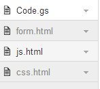
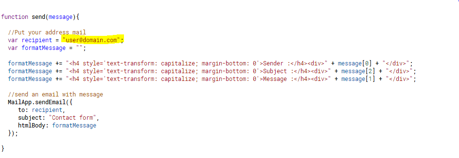
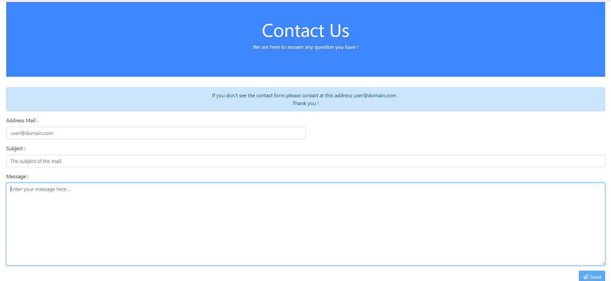

# GmailApp

## What is it ?

Using a form html to send a email.

## How ?
1. Create a new project of google app script them copy the code to your project.
- Create 3 html files and 1 gs file and copy paste like the code.

2. You must change the address mail to yours.

3. Then save and deploy it as web app and  accept the autorization to your script.

4. You will see the page like this :

- You will have a link like that to test your web app :
https://script.google.com/macros/s/[KEY]/exec

