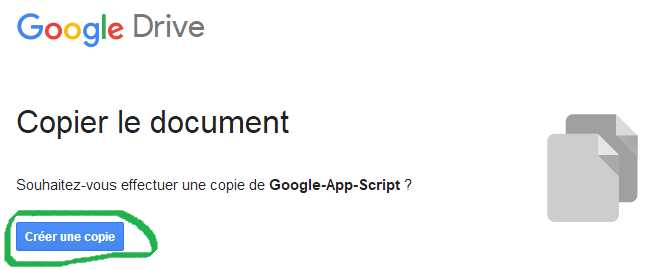
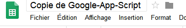
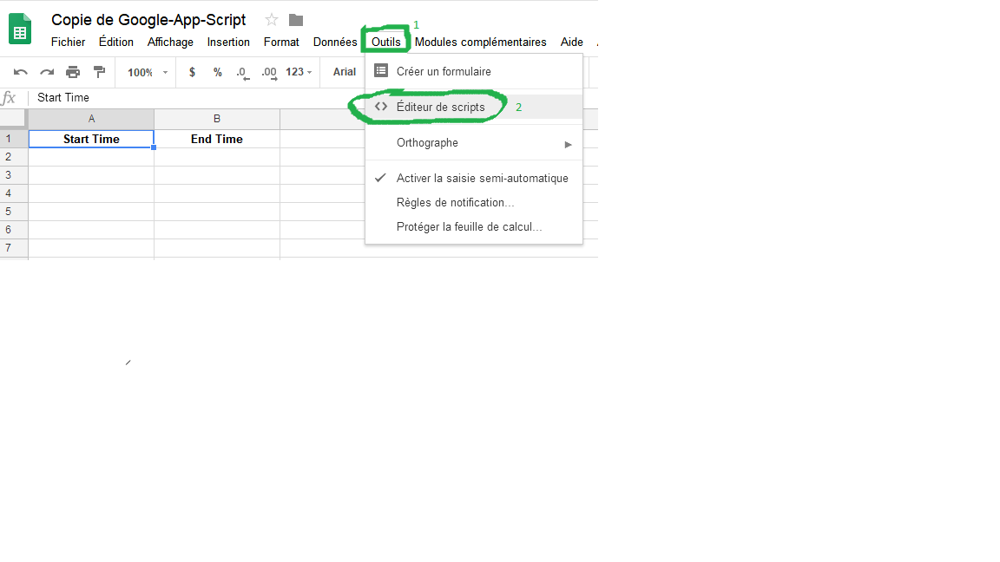
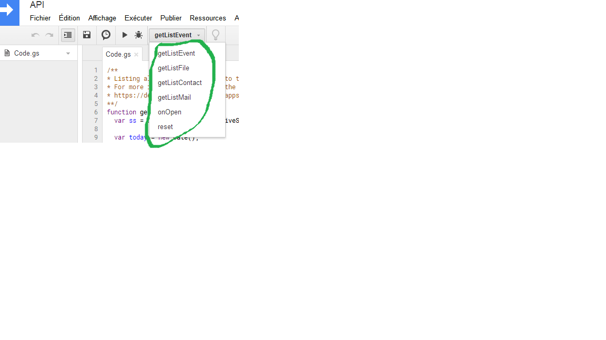
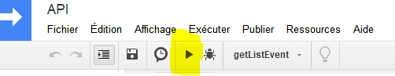
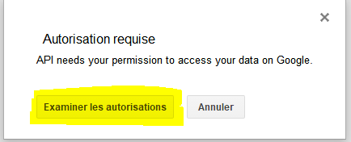
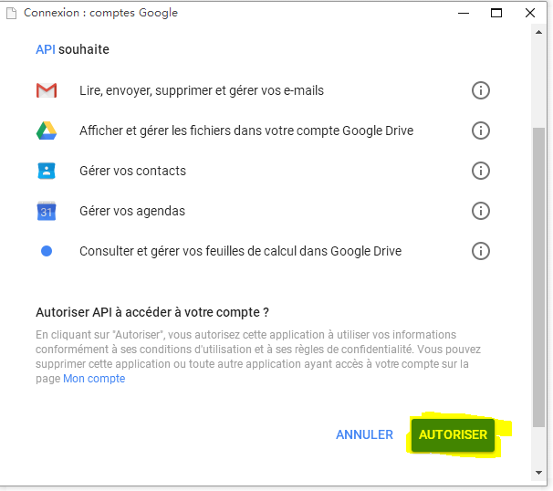
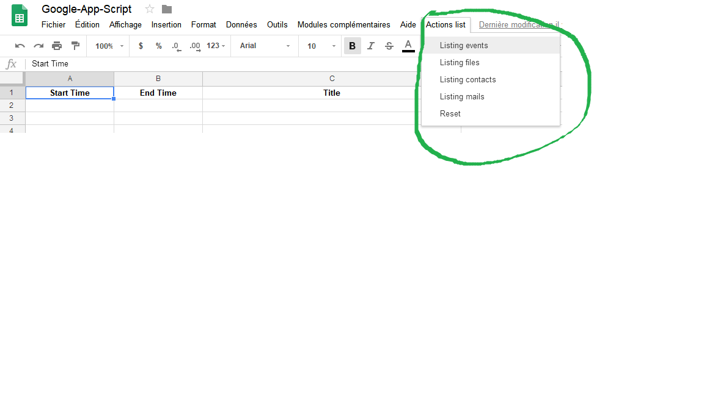

# Using google spreadsheets API to store and collect data

This is some example how to interact with spreadsheet and google services. 
In this folder you will find the code interacting with gmail, drive, calendar and contact.

## How ?

1. Make a copy of the spreadsheet

[The sample link](https://docs.google.com/spreadsheets/d/1VdfY66N68NR3qHi4vxIc0bS518f_7aAMjRx_w2K3gQk/copy)

Sign in with you google  account and click on "Créer une copie"

You will have something like this:

2. Open the Script editor

Open the script editor by clicking Tools > Script editor

3. Save your new script (ctrl+s)

4. Execute all function to accept the autorization of the script

- Select one function

- Then play the function

- And allow the autorization

5. How to execute the function

- First option: Execute the function in the script editor

- Second option: Execute the function in google sheet menu by clicking Actions List and select the function
